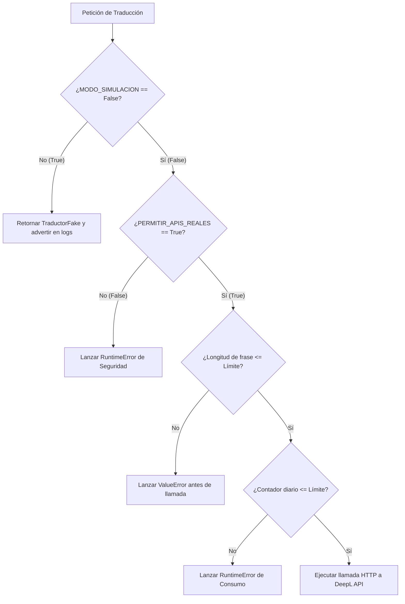

# Plan de Implementación: Fase 2 — Traducción Real Mínima
# File: output/plan_fase_2.md
# ──────────────────────────────────────────────────────────────────────
# Propósito: Registrar las decisiones técnicas, diseño y plan de pruebas
#            para la integración segura del primer proveedor real de texto.
# Rol: Entregable Oficial de la Fase 2 (Plan de Implementación)
# ──────────────────────────────────────────────────────────────────────

> [!IMPORTANT]
> Este documento representa el entregable oficial y el **Audit Trail (Traza Acumulativa)** para la transición entre la Fase 1 (Simulación) y la Fase 2 (Traducción Real Mínima). **No se escribirá código ni se instalarán dependencias reales hasta que este plan reciba la aprobación explícita del usuario.**

---

## 1. Traza Acumulativa (Audit Trail) - Control de Cambios

Conforme a la **Regla 3.6 de Trazabilidad incremental obligatoria**, registramos el estado del proyecto para esta fase:

*   **CONSERVADO:**
    *   La arquitectura modular basada en puertos abstractos de traducción y voz (`PuertoTraductorTexto`, `PuertoGeneradorVoz`).
    *   El adaptador simulado `TraductorFake` y `VozFake` en `src_lab/providers_fake/` (modo simulación activo por defecto).
    *   La caché JSON local por hashes MD5 (`CacheFrasesSimple`).
    *   Las utilidades de normalización de texto y medición de latencias.
    *   Las suites de pruebas automatizadas creadas en la Fase 1.
*   **CAMBIADO:**
    *   Ninguno en esta fase de planificación.
*   **AGREGADO (Conexión de APIs Reales):**
    *   Diseño del nuevo adaptador de traducción real para **DeepL** en `src_lab/providers_real/traductor_deepl.py`.
    *   Estructuración de la carpeta `src_lab/providers_real/` incluyendo su respectivo archivo de inicialización `__init__.py`.
    *   Integración de variables de entorno y umbrales económicos en la raíz del laboratorio (`.env.example`) para proteger contra llamadas de coste accidentales.
    *   Pruebas unitarias específicas con simulación (*mocks*) para la API de DeepL para verificar el comportamiento de seguridad antes de habilitar la red.

---

## 2. Respuestas a los Requisitos del Plan de Fase 2

### 2.1. Proveedor Inicial Recomendado y Justificación
Se elige **DeepL** como el primer candidato para traducción real de texto bajo la siguiente justificación técnica:
*   **Simplicidad de Integración:** Requiere únicamente de una clave de API sencilla inyectada localmente en el archivo `.env`. No exige la creación previa de proyectos, consolas de administración complejas en la nube (como Google Cloud Translation) ni configuración de cuentas de facturación corporativas reduciendo la fricción inicial.
*   **Foco y Especialización:** Es una API dedicada puramente al procesamiento de traducción de texto a texto, lo que se alinea de forma exacta con el alcance mínimo e incremental de la Fase 2.
*   **Potencial Calidad en Idiomas Europeos:** Ofrece una robusta arquitectura gramatical optimizada para pares lingüísticos europeos (como Español ↔ Rumano). Su calidad real no se dará por sentada, sino que **se validará empíricamente** a través de la medición y contraste manual de la suite de 6 frases de prueba.
*   **Capa Gratuita para el Laboratorio:** DeepL ofrece un plan gratuito que incluye **500,000 caracteres mensuales sin coste**. Esto permite realizar todas nuestras validaciones reales sin incurrir en costes iniciales.

### 2.2. Archivos a Crear y Modificar
Para evitar cualquier impacto negativo sobre la base estable de la Fase 1 y preservar la simulación intacta, la implementación se mantendrá estrictamente aislada:

#### A) Archivos Nuevos a Crear:
1.  **`src_lab/providers_real/__init__.py`:** Archivo de inicialización para declarar el módulo de proveedores reales.
2.  **`src_lab/providers_real/traductor_deepl.py`:** Implementación del adaptador real de DeepL. Hereda de `PuertoTraductorTexto` y realiza llamadas HTTPS asíncronas controladas.
3.  **`tests/test_traductor_deepl.py`:** Pruebas unitarias de comportamiento, flujos lógicos y límites con mock de la respuesta HTTP de DeepL.
4.  **`scripts/prueba_real_traduccion.py`:** Script mínimo ejecutable que intenta traducir la lista de frases de prueba ES ↔ RO únicamente si la configuración del entorno es 100% real y segura.

#### B) Archivos Existentes a Modificar:
1.  **`pyproject.toml`:** Declarar e instalar la dependencia oficial de DeepL (`deepl`) como una **nueva dependencia permitida únicamente a partir de la Fase 2**.
2.  **`src_lab/config/settings_lab.py`:** Añadir soporte para cargar y verificar las nuevas variables de configuración de DeepL desde el entorno.
3.  **`.env.example`:** Declarar en la raíz del laboratorio (`traductor_rumano_lab/.env.example`) las variables necesarias para configurar el adaptador real de traducción de forma segura.

---

### 2.3. Nuevas Variables de Entorno (`.env.example`)
El archivo de plantilla de entorno único del laboratorio (`traductor_rumano_lab/.env.example`) se extenderá con el siguiente bloque:

```env
# ──────────────────────────────────────────────────────────────────────
# CONFIGURACIÓN FASE 2: API DE TRADUCCIÓN REAL (DEEPL)
# ──────────────────────────────────────────────────────────────────────
# Clave de API de DeepL para pruebas reales de texto
DEEPL_API_KEY=tu_api_key_aqui

# Tipo de API de DeepL: true para cuenta Pro de pago, false para cuenta Free gratuita
DEEPL_USAR_PRO=false

# Límite duro diario de caracteres permitidos para evitar costes por fugas en el laboratorio
MAX_CARACTERES_DIARIOS_TRADUCCION=5000
```

---

### 2.4. Prevención contra Llamadas Accidentales a la API Real
Implementaremos una **estrategia de triple barrera de protección** a nivel de código en el adaptador de DeepL para asegurar el control absoluto de consumo de red:



1.  **Barrera 1: Doble Confirmación Obligatoria:** Si la variable `MODO_SIMULACION` es `True` o `PERMITIR_APIS_REALES` es `False` (comportamiento por defecto de seguridad), el adaptador se bloquea de inmediato a nivel de constructor o método, impidiendo toda salida de red.
2.  **Barrera 2: Excepción por Credenciales Vacías:** Si el usuario activa el modo real pero la clave `DEEPL_API_KEY` no se encuentra definida en el `.env`, el sistema arroja una excepción explícita de configuración y detiene el pipeline.
3.  **Barrera 3: Safety Catch de Payload Local:** El adaptador medirá de forma determinista la longitud del payload de entrada. Si la frase supera el límite de seguridad establecido (`MAX_CARACTERES_POR_FRASE = 300`) o el volumen excede el umbral de caracteres diarios, se bloquea la llamada HTTP localmente antes de invocar la API.

---

### 2.5. Integración con la Caché Existente
La caché actúa como el escudo primario del sistema. El pipeline de traducción real se acoplará de la siguiente forma:

1.  **Entrada:** Se recibe la frase original y el idioma destino.
2.  **Normalización:** La frase pasa por `normalizar_texto.py` para homogeneizar espacios, puntuación y mayúsculas/minúsculas.
3.  **Búsqueda en Caché:** Se calcula el hash MD5 de la frase normalizada y se consulta en `CacheFrasesSimple`.
4.  **Decisión:**
    *   **Si hay Hit (Caché exitosa):** Se retorna la traducción directamente del archivo JSON local. **Se registra un consumo de API = 0 caracteres y latencia de 0ms**. La llamada a la API de DeepL no ocurre.
    *   **Si hay Miss (Caché vacía):** Se llama al adaptador `TraductorDeepL`. Una vez obtenida la traducción real, esta se indexa automáticamente con su hash en la caché JSON persistente para futuras consultas.

---

### 2.6. Pruebas Unitarias Planificadas
Crearemos la suite `tests/test_traductor_deepl.py` para asegurar que las validaciones lógicas funcionen de forma determinista sin realizar conexiones físicas de red en los tests diarios:

*   `test_deepl_bloqueo_si_apis_reales_desactivadas`: Configura temporalmente `PERMITIR_APIS_REALES=False` y valida que la petición a traducción real falle de forma controlada levantando un `RuntimeError`.
*   `test_deepl_error_si_key_vacia`: Configura una clave vacía y valida que se lance un error de inicialización seguro.
*   `test_deepl_limite_caracteres_excedido_en_adaptador`: Verifica que frases superiores al límite establecido (por ejemplo, 301 caracteres) sean rechazadas antes de contactar a DeepL.
*   `test_deepl_llamada_correcta_con_mock`: Utiliza `unittest.mock` para simular la respuesta HTTP exitosa de la API de DeepL, validando que el adaptador parsee el JSON de respuesta de forma exacta y devuelva la traducción esperada.

---

### 2.7. Control de Seguridad e Inalterabilidad de Flags en Scripts
El script de prueba real mínima `scripts/prueba_real_traduccion.py` **NO modificará ni anulará temporalmente los flags de seguridad en tiempo de ejecución**. 

El script funcionará bajo el principio estricto de **confianza cero**:
*   Leerá directamente la configuración cargada del archivo `.env` local.
*   **Si `MODO_SIMULACION` no está configurado explícitamente como `false` o `PERMITIR_APIS_REALES` no es `true`**, el script se detendrá preventivamente arrojando un error claro por consola (`"Error de Seguridad: No se pueden realizar llamadas reales bajo la configuración actual del entorno."`).
*   Solo cuando el programador configure de forma física e intencionada el `.env` con `MODO_SIMULACION=false` y `PERMITIR_APIS_REALES=true`, el script procederá a traducir una suite máxima de **3 frases ES→RO y 3 frases RO→ES**, registrando latencia real y guardando el reporte.

---

### 2.8. Justificación de Estrategia de Dependencia Única
En la Fase 2 optamos por la **Opción A: usar la librería oficial `deepl`** como la única dependencia nueva autorizada para la integración.

*Justificación Técnica:*
*   **Reducción de Deuda Técnica:** La SDK oficial encapsula de forma nativa la gestión de reintentos, parámetros y respuestas de la API de DeepL, reduciendo código manual en el laboratorio.
*   **Políticas de Reintento con Backoff Exponencial:** Cuenta con algoritmos nativos y robustos para reintentar de forma segura en caso de problemas transitorios de red, evitando el sobreconsumo o el bloqueo manual de hilos del pipeline.
*   **Tipado y Seguridad:** Ofrece tipado estático completo en Python que mejora las validaciones automáticas con herramientas estáticas como `ruff` y MyPy.
*   *Nota:* Aunque `httpx` (ya instalado en Fase 1) es excelente, realizar las llamadas directas HTTPS a la API de DeepL nos obligaría a programar a mano el control de reintentos, el parseo de códigos de error específicos y la estructura multipart de peticiones, agregando código propenso a errores y alejándonos del enfoque Lean.

---

### 2.9. Criterios de Validación GO / NO-GO (Fase 2)
El avance de la Fase 2 se evaluará estrictamente bajo la matriz de `docs/07_tests_validacion_y_go_no_go.md`:

| Criterio | Estado GO | Estado NO-GO |
| :--- | :--- | :--- |
| **Integridad de Red** | La API de DeepL responde con latencias < 500ms por frase y con un consumo estable. | Timeouts repetitivos (> 3 segundos) o errores HTTP de cuota/credenciales (401, 429). |
| **Comportamiento Caché** | Las frases traducidas en la primera pasada se resuelven en 0ms y con 0 llamadas a la API en pasadas posteriores. | La caché no persiste los hashes o se realizan llamadas redundantes de red para textos idénticos. |
| **Seguridad de Secretos** | Ninguna clave API aparece en la consola, archivos de salida ni logs. El archivo `.env` es completamente ignorado. | Exposición accidental de la clave de API en archivos de resultados, logs o historial de git. |
| **Calidad de Traducción** | Las traducciones ES ↔ RO son gramaticalmente legibles y naturales (verificación manual por el usuario). | Traducciones incomprensibles, erróneas o con pérdidas graves de sentido familiar. |

---

### 2.10. Comandos de Validación Final
Para aprobar técnicamente la entrega de la Fase 2 y garantizar que no se haya roto ningún componente de la Fase 1, ejecutaremos la siguiente suite determinista de validación final en WSL:

```bash
# 1. Asegurar limpieza de estilo y lints
uv run ruff check .

# 2. Ejecutar la suite de pruebas unitarias (incluyendo mocks de DeepL y tests de Fase 1)
uv run pytest

# 3. Comprobar que el entorno valida correctamente la conmutación segura
uv run python scripts/verificar_entorno.py

# 4. Ejecutar el pipeline de prueba real controlada (con el .env configurado con clave real)
uv run python scripts/prueba_real_traduccion.py
```

---

### 2.11. Elementos Intactos (LO QUE NO SE DEBE TOCAR)
*   **La suite de tests de la Fase 1** (`tests/test_traductor_fake.py`, `tests/test_voz_fake.py`, etc.).
*   **La lógica de simulación:** Las clases `TraductorFake` y `VozFake` en `src_lab/providers_fake/` deben mantenerse 100% funcionales y listas para actuar si el sistema está en modo simulación.
*   **Las carpetas de documentación técnica** `docs/` y `docs/adr/`, garantizando que mantengan el historial y la gobernanza arquitectónica originales sin ninguna modificación de lógica ni contenido.

---

## 3. Aprobación Requerida

Para proceder a la Fase 2 de forma segura, el usuario debe aprobar este plan. 

> [!CAUTION]
> **Si apruebas el plan, escribe exactamente en tu respuesta:**  
> `Aprobado: Plan Fase 2` (para cumplir con la regla de oro anti-ambigüedad del workspace).

---
